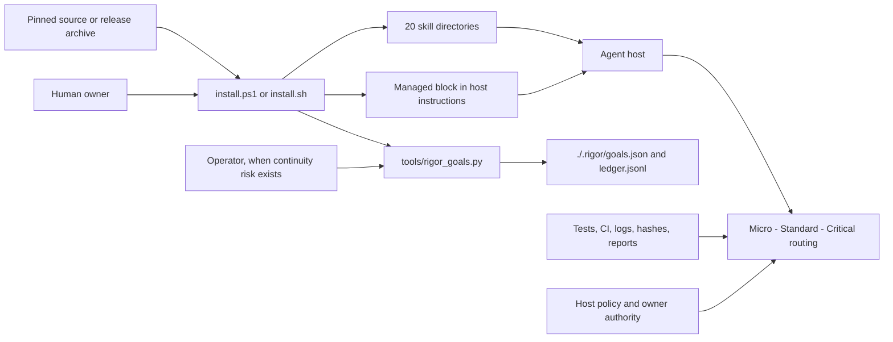
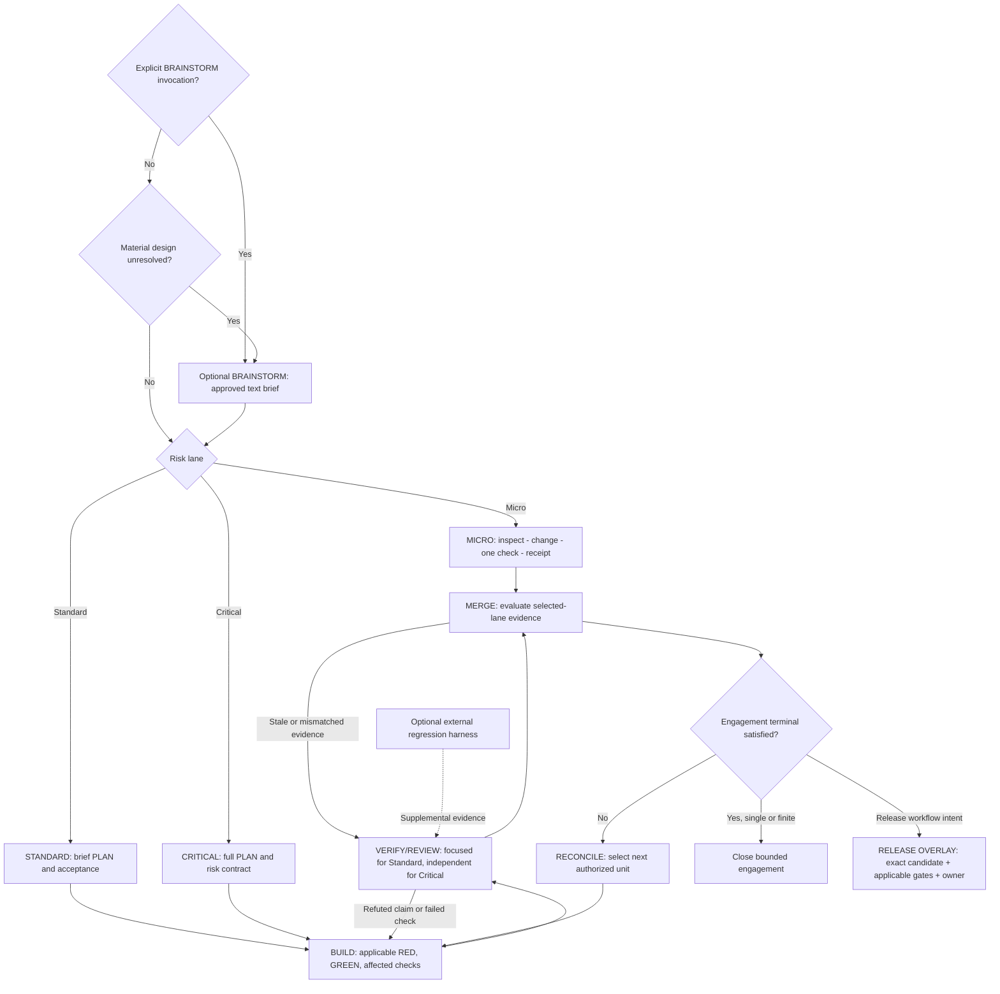

# Architecture

dev-rigor-stack-lite is a portable set of Markdown workflows plus two small,
local persistence mechanisms. It does not run a service and it does not add
hooks, a background process, trust activation, Stop interception, or a private
evidence ledger.

## Installed components

Text fallback: a human runs one of the installers from pinned source. The
installer copies the 20 skill directories, one Python tool, and one
marker-fenced block in a host instructions file. The host reads the skills and
anchor. For cross-session work, handoffs, parallel agents, or external waits, the
operator invokes the goals tool, which writes project-local state under `./.rigor/`.
Ordinary same-session work skips it. Tests, CI, and other raw artifacts feed the selected lane.
Host policy and human authority still control permissions, merges, and
publication.

| Component | Responsibility | Explicit limit |
|---|---|---|
| `skills/` | Portable workflow instructions and entrypoints | Instructions are not mechanical enforcement |
| `anchor/anchor.md` | A short, persistent reminder in the host instructions file | Only the marker-fenced span is managed |
| `tools/rigor_goals.py` | Mode-pinned engagement state, ordered units, and structural evidence gates | It records evidence; it does not execute the command or decide that the recorded result is true |
| `./.rigor/` | Current worktree's plan and append-only event ledger | Ordinary local files, not tamper-resistant storage |
| `install.ps1` and `install.sh` | Copy the three tiers to explicit or inferred locations | Run only with the invoking user's permissions |

## Delivery control flow

Text fallback: Explicit invocation always activates BRAINSTORM, even when the brief is decision-complete.
Without explicit invocation, materially unresolved design work may use optional BRAINSTORM
before lane selection, while a decision-complete brief skips it. Localized mechanical work uses Micro. Ordinary work uses Standard.
Named risks such as auth, money, persisted data, security, concurrency, installers,
irreversible operations, or broad public contracts use Critical. Standard applies
RED/GREEN and focused review where relevant; Critical adds independent proof. Release
binds evidence to the exact candidate and selects only applicable gates. External
harnesses can add evidence but cannot replace the selected lane.

## Engagement state machine

Risk lane and engagement mode answer different questions. Micro, Standard, and Critical
select rigor for the current unit. `single_unit`, `finite_program`,
`continuous_development`, and `release_workflow` decide whether completing that unit may
end the larger engagement. The recorded mode persists across agents, sessions, and
machines; continuing owner language defaults to continuous development, and only the
owner may downgrade the mode.

Schema 2 stores the mode, terminal predicate, release intent, optional next-goal choice,
closure state, and existing goal list in `goals.json`. `ledger.jsonl` records loud plan
replacement, migration, queue addition, ordering, checkpoints, and closure with the
`plan_id`. Version 1 plans migrate once to `finite_program`, preserving their goals and
statuses; because old state did not record intent, the owner must review that conservative
default and use the loud mode-change path when necessary. Unknown schemas or modes are
refused. `release_intent` is `none`, `candidate`, or `publish` and is carried into the
closure receipt. `waiting_external` and `blocked_owner` remain unresolved until reopened
or otherwise authorized. In continuous or release mode, an empty
known queue remains active. A unit merge therefore returns to reconcile and select-next
unless the recorded terminal and authority conditions permit closure.

All CLI commands take an atomic-create mutation lock, so concurrent processes refuse
instead of racing a read-modify-write update. `goals.json` itself is written through an
fsynced temporary file and atomic replacement. The goals state and append-only ledger
remain separate files, however; they are not a single crash-atomic transaction. An OS or
storage failure between state replacement and ledger append can require operator
reconciliation. This is a documented Lite boundary, not an integrity guarantee.

The Python suite and bundle validator mechanically exercise schema migration, mode-gated
closure, nonterminal queue exhaustion, queue mutation, ordering, checkpoint states, and
anchor markers. This schema is separate from run-manifest schema 1.1, which identifies
stage evidence. Worker-local `DONE`, receipt wording, and coordinator choice after a
merge are advisory model-behavior contracts: Lite has no host hook that can mechanically
test adherence. They are documented separately so CI evidence is not overstated.

## Boundaries and trust

- The bundle has no long-running runtime and opens no network connection during
  normal use. CI and users may run their own networked tools outside this
  boundary.
- Host policy owns tool availability, filesystem and network permissions,
  delegation, approvals, and whether an agent may merge or publish. Passing a
  workflow gate grants none of those permissions.
- The installers trust the source tree, target paths, and explicit overrides
  supplied by the human operator. `-Force` or `--force` replaces only
  manifest-named skill directories, refreshes the installed goals file, and
  updates the managed anchor span.
- The anchor is ordinary text in a host instructions file. It can influence an
  agent that reads it, but it cannot override host policy or protect itself
  from a process with write access.
- `./.rigor/` is a continuity aid, not a security boundary. A process that can
  edit or delete worktree files can alter or remove it. Do not put secrets in
  the plan, ledger, or evidence.
- Evidence is valid only to the extent that its exact candidate identity,
  environment, command, and raw artifacts support the claim. The goals tool's
  recorded result is not independent proof.

For installation and lifecycle procedures, see the [manual](manual.md). For
security reporting and operational limits, see [SECURITY.md](../SECURITY.md).
