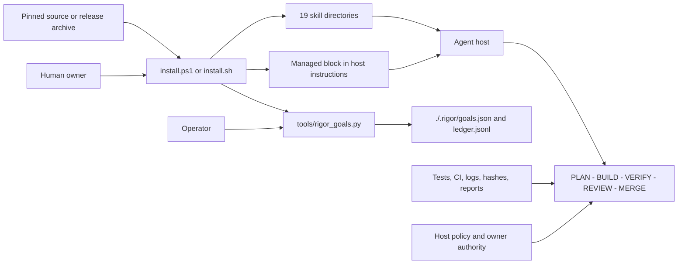
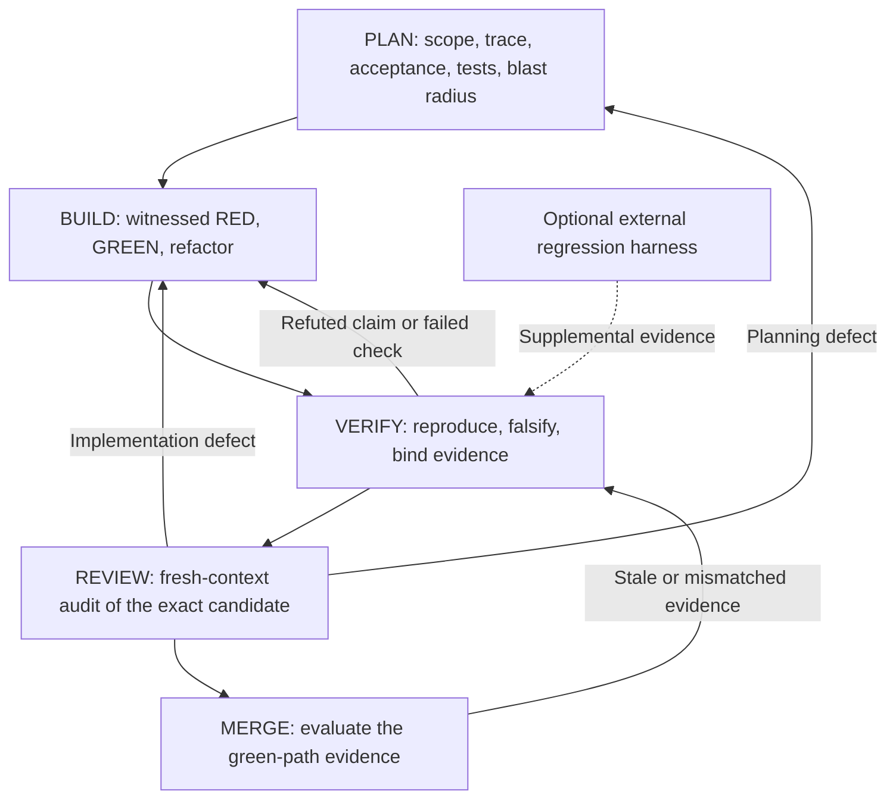

# Architecture

dev-rigor-stack-lite is a portable set of Markdown workflows plus two small,
local persistence mechanisms. It does not run a service and it does not add
hooks, a background process, trust activation, Stop interception, or a private
evidence ledger.

## Installed components

Text fallback: a human runs one of the installers from pinned source. The
installer copies the 19 skill directories, one Python tool, and one
marker-fenced block in a host instructions file. The host reads the skills and
anchor. The operator invokes the goals tool, which writes project-local state
under `./.rigor/`. Tests, CI, and other raw artifacts feed the workflow gates.
Host policy and human authority still control permissions, merges, and
publication.

| Component | Responsibility | Explicit limit |
|---|---|---|
| `skills/` | Portable workflow instructions and entrypoints | Instructions are not mechanical enforcement |
| `anchor/anchor.md` | A short, persistent reminder in the host instructions file | Only the marker-fenced span is managed |
| `tools/rigor_goals.py` | Sequential task state and a final evidence-recording gate | It records evidence; it does not execute or validate the recorded command |
| `./.rigor/` | Current worktree's plan and append-only event ledger | Ordinary local files, not tamper-resistant storage |
| `install.ps1` and `install.sh` | Copy the three tiers to explicit or inferred locations | Run only with the invoking user's permissions |

## Delivery control flow

Text fallback: PLAN defines the contract, BUILD uses test-first implementation,
VERIFY tries to refute the claims, REVIEW inspects the exact candidate without
the builder's narrative, and MERGE evaluates the resulting evidence. A red
result returns to the phase that owns the defect. External harnesses can add
evidence but cannot replace these gates.

## Boundaries and trust

- The bundle has no long-running runtime and opens no network connection during
  normal use. CI and users may run their own networked tools outside this
  boundary.
- Host policy owns tool availability, filesystem and network permissions,
  delegation, approvals, and whether an agent may merge or publish. Passing a
  workflow gate grants none of those permissions.
- The installers trust the source tree, target paths, and explicit overrides
  supplied by the human operator. `-Force` or `--force` replaces only
  manifest-named skill directories, refreshes the installed goals file, and
  updates the managed anchor span.
- The anchor is ordinary text in a host instructions file. It can influence an
  agent that reads it, but it cannot override host policy or protect itself
  from a process with write access.
- `./.rigor/` is a continuity aid, not a security boundary. A process that can
  edit or delete worktree files can alter or remove it. Do not put secrets in
  the plan, ledger, or evidence.
- Evidence is valid only to the extent that its exact candidate identity,
  environment, command, and raw artifacts support the claim. The goals tool's
  recorded result is not independent proof.

For installation and lifecycle procedures, see the [manual](manual.md). For
security reporting and operational limits, see [SECURITY.md](../SECURITY.md).
