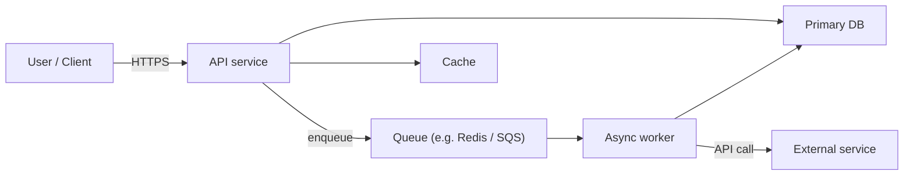
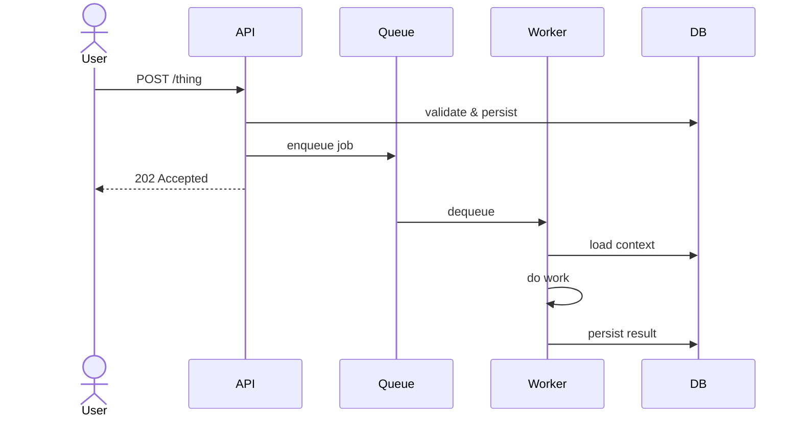
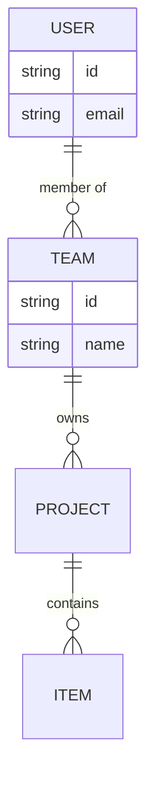

# Architecture — [Project Name]

> A new engineer should be able to read this document, in 20 minutes, and know how the system is shaped well enough not to break it. That's the bar.

---

## Overview

[1–2 paragraphs. What kind of system is this (CLI / library / web app / SaaS platform / pipeline / distributed service)? What are its primary inputs and outputs? Who runs it? What are the main constraints (latency, scale, cost, compliance)?]

## System diagram — high level

> Mermaid renders in GitHub and most modern markdown tools. Adapt the node names to match the real system.

*Replace with the real topology. Keep the diagram readable — prefer two diagrams at different zooms over one that tries to say everything.*

---

## Components

### [Component name]
- **Responsibility:** [one sentence]
- **Location in repo:** `[path]`
- **Key dependencies:** [internal and external]
- **Scaling profile:** [stateless / stateful / singleton / clustered]

[Repeat for each major component. Keep each entry short — the point is orientation, not exhaustive reference.]

---

## Data flow for the core use case

> Pick the single most important user journey or pipeline and walk it end-to-end. Most architecture docs fail by being abstract — tell a concrete story.

[Narrate the diagram in prose for the parts that aren't self-evident.]

---

## Data model (high level)

[The 5–10 most important entities, their relationships, and what makes each one special. Not an exhaustive schema — a reader orientation.]

---

## Boundaries, contracts, and ownership

### External services this project depends on

| Service | Purpose | SLA expectation | Failure mode |
|---|---|---|---|
| [service] | [what it does for us] | [what we assume] | [what happens when it's down] |

### APIs this project exposes

| API | Consumers | Stability | Versioning |
|---|---|---|---|
| [API name] | [who uses it] | [stable / beta / internal] | [strategy] |

### Data ownership

[Which components own which data. Where the source of truth lives. Any replication or caching that could confuse a new engineer.]

---

## Cross-cutting concerns

### Authentication and authorization
[How auth works. Where auth state is carried. Where authorization checks happen. Where they don't (yet).]

### Observability
[Logs, metrics, traces. Where they go. How to query them.]

### Error handling
[How errors propagate. What gets retried, what doesn't. Where the dead-letter queue lives, if any.]

### Deployment and environments
[How code goes from commit to production. Environments (dev / staging / prod), their differences, how to promote.]

---

## Decisions and tradeoffs

> Short explanations of the choices that shaped this system. A new engineer can often understand "why?" faster from a decision log than from reading source.

- **Chose [X] over [Y] because [reason].** Tradeoff accepted: [what we gave up].
- **Chose [X] over [Y] because [reason].** Tradeoff accepted: [what we gave up].

[Expand as needed. If the project maintains a `decisions/` or `docs/adr/` directory for Architecture Decision Records, link here instead.]

---

## Known debt and future shape

[Honest list of what needs rework and why it hasn't happened yet. This is not a failure — it's a gift to future contributors.]

- **[Debt item]** — [why it exists, when it becomes urgent, what "done" would look like]

---

## Onboarding checklist for new engineers

- [ ] Clone the repo, run the setup script, get tests passing locally
- [ ] Read this document end-to-end
- [ ] Walk the core use case (see "Data flow" above) in the running product
- [ ] Read the primary entry-point file for each component listed above
- [ ] Ask [someone] about [the one thing this doc can't really teach]

---

*This doc is maintained alongside the code. If the system changes, this changes. Out-of-date architecture docs do more harm than no architecture doc — so if you see a drift, fix it in the same commit that introduced the drift.*
